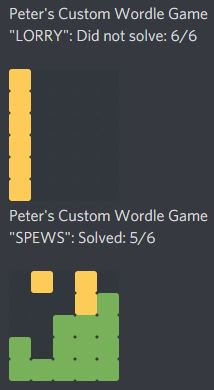

# Wordle C++ with SMFL

Wordle is a popular word game found at: https://www.powerlanguage.co.uk/wordle/
 In the original game there is one set word shared for every person each day. This version of the game lets you try and guess many different words as you want. 

* Word data source: https://www-cs-faculty.stanford.edu/~knuth/sgb.html

* You can also find my solver at: ([Github Link](https://github.com/Squirrelbear/Wordle-Solver))

Requires the following to compile:
* SFML 2.5.1 (may work with other versions, but 2.5.1 was used for testing): https://www.sfml-dev.org/download.php
* C++17 by adding: /std:c++17

# Gameplay

You can play the game by either clicking on the keys at the bottom or by typing letters. You can also undo letters by clicking the \< or pressing backspace. And when you have entered a full word you can click on "Check" or press enter to have your word evaluated. The result will show a slightly different tint of grey for letters that should not appear in the solution, a dull yellow if the letter does appear somewhere in the word but not at that position, and green if you have the letter in the correct position. You should use the guesses to narrow down the solution. You have up to 6 attempts before running out of guesses. 

Example victory screen with options to start a new game, quit, or share to clipboard. You can also view stats from how you have been going on the left and via the histogram in the middle.

Similar to the victory screen the loss screen shows no highlighted bar and different coloured title text. You can still share your loss if you wish via the share button.

Using the share button will give you a string that can be pasted into places like Discord or Facebook to share your score. This uses the same tile approach as output by the original Wordle game's share button.

